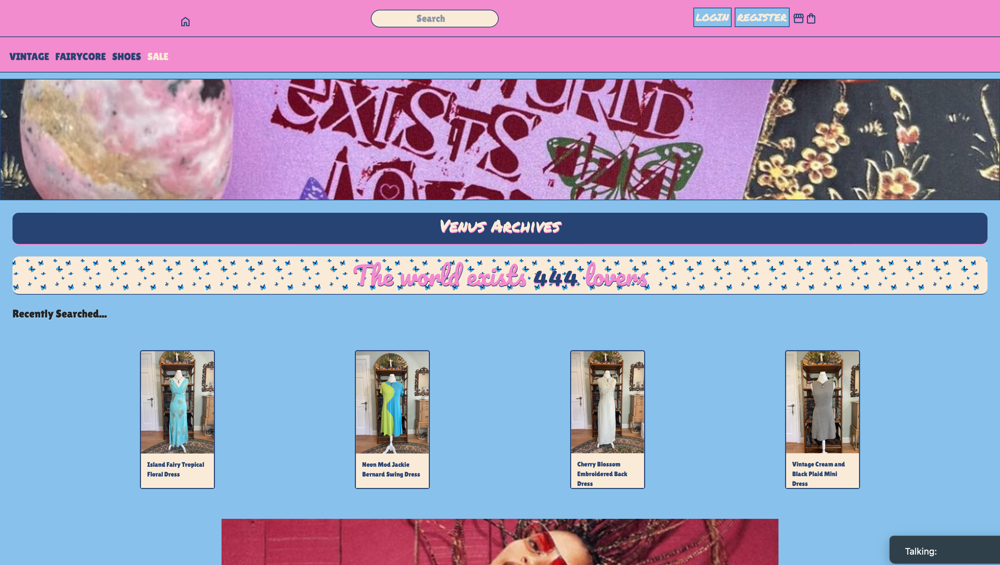
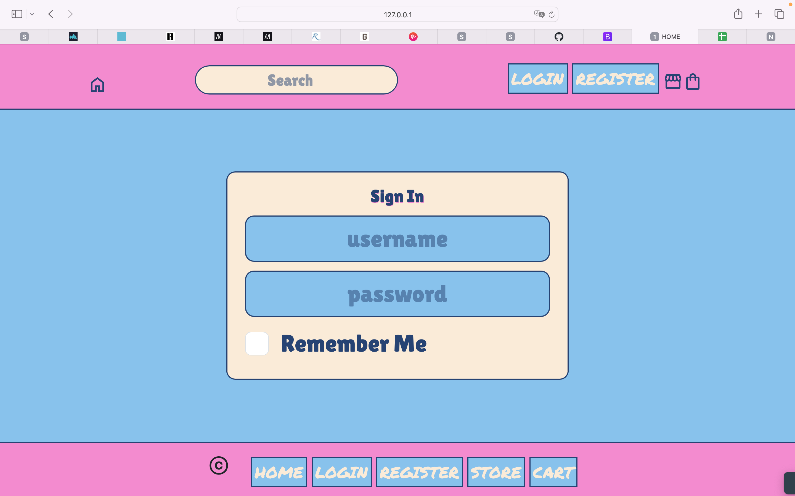
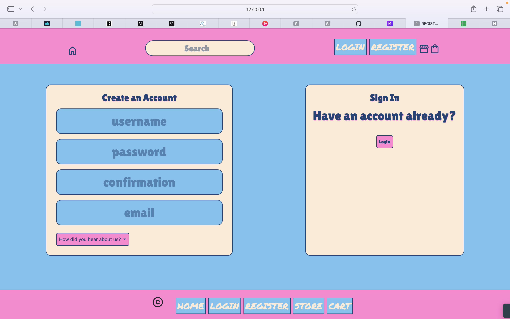
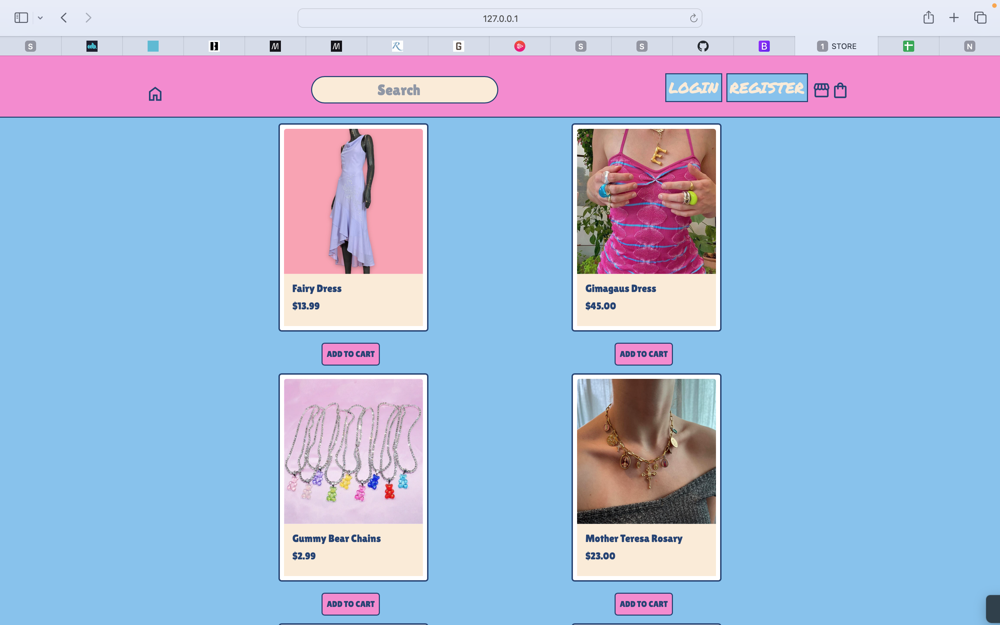
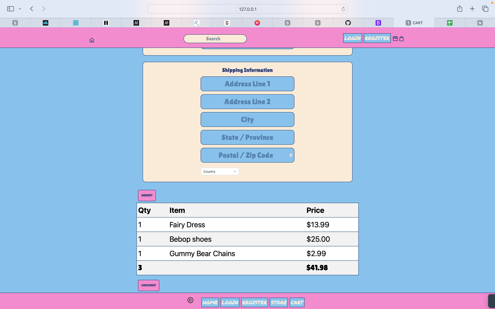

# Capstone 1

This website is inspired by my girlfriend's resale brand titled "Venus Archives". I wanted to use this capstone opportunity to create a mockup website for her that would serve as an outlet for her to reach the masses through her creative ideas. The site is inspired by Depop's website. Since the merchandise is predominately marketed towards women, I wanted to give the site a cute, girly pop with my choice in layout and coloring. 

## Home Page
information about the page

## Login Page

## Register Page

## Store Page
I was particularly proud with how the Store merchandise layout came to fruition. It was my first time using the Bootstrap grid function, while also mixing it with some Flexbox. It took me a while to really get it to lay out on the page the way I wanted it to, but when I finally figured it out the feeling was truly rewarding.

## Cart Page

